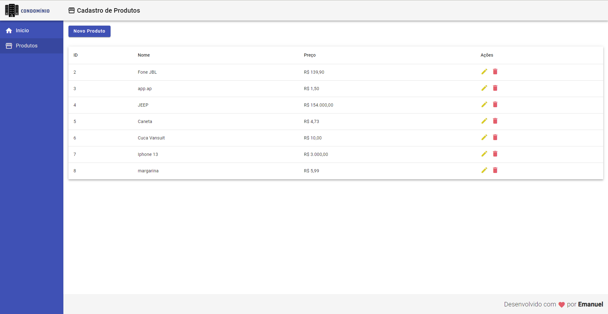
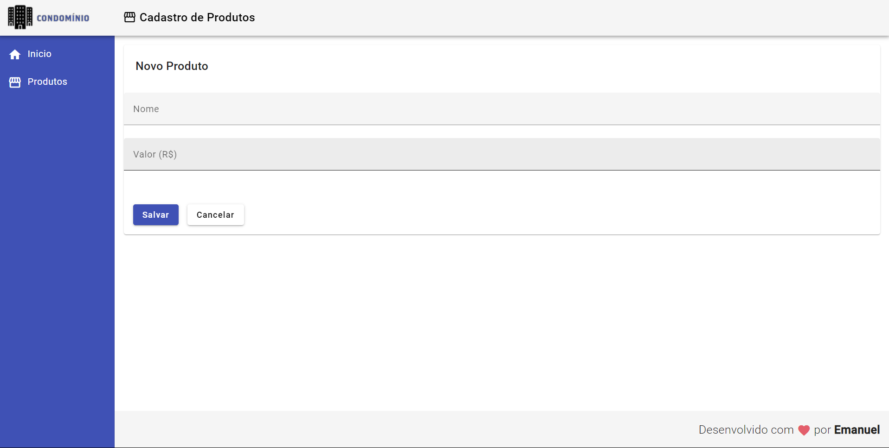

# CRUD com Angular e DBJson
 
Primeiro projeto em que utilizo o framework Angular, foi utilizado um banco de dados com JSON para tornar o estudo mais completo

## Tecnologias utilizadas 

- Angular
- Typescript
- HTML
- CSS

## Imagens da aplicação

## Como executar

### BACK-END 

Para executar o back-end, é necessario iniciar o comando NPM START, assim o DBJson já estará pronto para uso.

### FRONT-END

Para executar o front, é necessário ter o NodeJS e Angular CLI instalados. Após instalados, basta iniciar o comando npm i ou npm i --f. Com as pastas do node_modules instalada, inicie o projeto com ng s --o
